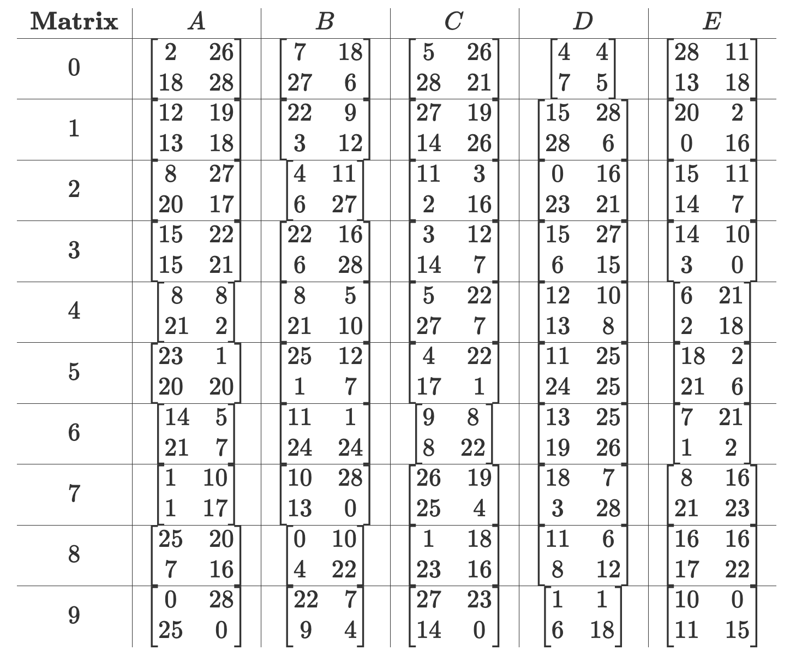

# 3SS Tutorial

## Table of Contents
- [Communication Key](#communication-key)
  - [Matrices](#matrices)
  - [Timezone Codes](#timezone-codes)
  - [Plaintext Codes](#plaintext-codes)
  - [Format](#format)
- [Encode](#encode)
  - [1. Hill Cipher](#1-hill-cipher)
  - [2. Rail Fence](#2-rail-fence)
  - [3. Affine](#3-affine)
  - [4. Output](#4-output)
- [Decode](#decode)
  - [1. Reading the Communication Key](#1-reading-the-communication-key)
  - [2. Affine](#2-affine)
  - [3. Rail Fence](#3-rail-fence)
  - [4. Hill Cipher](#4-hill-cipher)
- [Statistics](#statistics)

---

## Communication Key
The communication key (or $CK$) is the 8-character combination used to tell the application what specifications to use. This is decided by the encoders and decoders as soon as the Dark Agent has left. The $CK$ should be known between both teams. There should be a safe way to not only communicate it with the other team, but also a safe way to remember or write it somewhere. This communication must be discrete, as if it's revealed, then all ciphertext becomes vulnerable.

### Matrices
First, select a random matrix from the table below. That matrix will become the encoding matrix for the [Hill Cipher](#1-hill-cipher) step of 3SS. The matrix code used for the communication key will be the matrix's column then row. For example, $A1$ would correspond to the matrix in Column A, row 1. This code will become the $(Matrix)$ portion of the communication key. The inverse matrix is calculated by the computer of the Decoders.

### Timezone Codes
Then, assign the two encoders. Depending on who they are, there will be a specific time zone code. This numbers listed in the table below are used in the [Rail Fence](#2-rail-fence) and [Affine](#3-affine) steps of 3SS, as they represent the timezones of each person's native country relative to UTC. To create the code, first find the first encoder's corresponding $Letter$, and then have them decide whether they want Daylight Savings applied. If they don't apply DST, then add a $0$ to the end of the letter. Otherwise, add a $1$. This is the first encoder's timezone code. For example, if **Ben** was the first encoder and he decided to apply DST, then his timezone code would be $A1$. The process is the same for the second encoder's timezone code, instead using their own corresponding $Letter$. These two codes comprise the $(\text{Timezone 1})$ and $(\text{Timezone 2})$ portions of the communication key. Calculations are made with these numbers on both the encoders' and decoders' computers.

$$
\begin{array}{c|c|c|c}
\textbf{Name}&Letter&0&1\\
\hline
Ben&A&+8&+9\\
\hline
Ember&B&+1&+2\\
\hline
Manny&C&-4&-3\\
\hline
Stacey&D&-5&-4\\
\hline
Viktorija&E&+2&+3
\end{array}
$$

### Plaintext Codes
Then, select a random column and row, and the corresponding letter will be the correct plaintext that will be read by the decoders. This is crucial in the [Output](#4-output) step of 3SS. The plaintext code will be the location of the cell you chose, being column followed by row. For example, $B2$ corresponds to $A$, meaning the decoders will ignore the two other plaintexts and focus on plaintext $A$. The Plaintext Code will be read by the decoders.

$$
\begin{array}{c|c|c|c}
\textbf{Plaintext}&A&B&C\\
\hline
    0&A&C&B\\
\hline
    1&B&A&C\\
\hline
    2&B&C&A\\
\hline
    3&C&A&B\\
\hline
    4&C&B&A\\
\end{array}
$$

### Format
Finally, the way to format the Communicaiton key is simple. Take all four codes, join them together, and then convert them to decimal from a hex number. Once you have devised the decimal number, it may be communicated with both the encoding and decoding teams. The format will look like below.

$$\text{[Matrix][Timezone 1][Timezone 2][Plaintext]}\_{16}\rightarrow\text{Communication Key}\_{10}$$

- #### Ex. 1
  - **Matrix** - A1
  - **Timezone 1** - Encoder 1 is Ben
    - **DST** - No
  - **Timezone 2** - Encoder 2 is Ember
    - **DST** - Yes
  - **Plaintext** - B1

$$ 
CK = A1A0B1B1_{16}= 2711663025_{10} 
$$

- #### Ex. 2
  - **Matrix** - C5
  - **Timezone 1** - Encoder 1 is Stacey
    - **DST** - Yes
  - **Timezone 2** - Encoder 2 is Manny
    - **DST** - No
  - **Plaintext** - A3

$$ 
CK = C5D1C0A3_{16}= 3318857891_{10} 
$$

---

## Encode
This is what is the entire program is doing for you below the GUI. Keep in mind the constructed Communication Key in Hex format. For this example, we will use the Communication Key $D4C1B0C2$ and the plaintext "Hello,world.". This algorithm uses a 29-letter alphabet ending in Space, Comma, and Period.

### 1. Hill Cipher
1. First, take your [encryption Matrix code](#matrices), signified by the first two characters of the Communication Key. The corresponding matrix will be your key matrix.

$$
\underbrace{D4}_\text{Matrix}C1B0C2\\
D4=\begin{bmatrix}12 & 10\\
13 & 8\end{bmatrix}
$$

2. Then, in a regular Hill Cipher, split the plaintext into 2x1 matrices, utilizing "*x*" as a null character if the plaintext has an odd number of characters, then convert them to their corresponding position in the alphabet where $A=0$

$$
\begin{bmatrix} H \\
E \end{bmatrix}
\begin{bmatrix} L \\
L \end{bmatrix}
\begin{bmatrix} O \\
, \end{bmatrix}
\begin{bmatrix} W \\
O \end{bmatrix}
\begin{bmatrix} R \\
L \end{bmatrix}
\begin{bmatrix} D \\
. \end{bmatrix}
\\
\rightarrow \\
\begin{bmatrix} 7 \\
4 \end{bmatrix}
\begin{bmatrix} 11 \\
11 \end{bmatrix}
\begin{bmatrix} 14 \\
27 \end{bmatrix}
\begin{bmatrix} 22 \\
14 \end{bmatrix}
\begin{bmatrix} 17 \\
11 \end{bmatrix}
\begin{bmatrix} 3 \\
28 \end{bmatrix}
$$

3. Then, multiply the key matrix by each 2x1 matrix, like you would normally do in a Hill Cipher

$$
\begin{bmatrix} 12 & 10\\
13 & 8 \end{bmatrix} \times
\begin{bmatrix} 7 \\
4 \end{bmatrix} =
\begin{bmatrix} 124 \\
123 \end{bmatrix}\\
\cdots \\
\begin{bmatrix} 12 & 10\\
13 & 8 \end{bmatrix} \times
\begin{bmatrix} 3 \\
28 \end{bmatrix} =
\begin{bmatrix} 316 \\
263 \end{bmatrix} \\
\rightarrow \\
\begin{bmatrix} 124 \\
123 \end{bmatrix}
\begin{bmatrix} 242 \\
231 \end{bmatrix}
\begin{bmatrix} 438 \\
398 \end{bmatrix}
\begin{bmatrix} 404 \\
398 \end{bmatrix}
\begin{bmatrix} 314 \\
309 \end{bmatrix}
\begin{bmatrix} 316 \\
263 \end{bmatrix}
$$

4. Then, modulo every number by 29

$$
\begin{bmatrix} 124 \\
123 \end{bmatrix} mod\ 29 =
\begin{bmatrix} 8 \\
7 \end{bmatrix} \\
\cdots \\
\begin{bmatrix} 316 \\
263 \end{bmatrix} mod\ 29 =
\begin{bmatrix} 26 \\
2 \end{bmatrix} \\
\rightarrow \\
\begin{bmatrix} 8 \\
7 \end{bmatrix}
\begin{bmatrix} 10 \\
28 \end{bmatrix}
\begin{bmatrix} 3 \\
21 \end{bmatrix}
\begin{bmatrix} 27 \\
21 \end{bmatrix}
\begin{bmatrix} 24 \\
19 \end{bmatrix}
\begin{bmatrix} 26 \\
2 \end{bmatrix}
$$

5. Finally, convert each number back into a letter using the same alphabet as before $(A=0)$ and that is your result.

$$
\begin{bmatrix} 8 \\
7 \end{bmatrix}
\begin{bmatrix} 10 \\
28 \end{bmatrix}
\begin{bmatrix} 3 \\
21 \end{bmatrix}
\begin{bmatrix} 27 \\
21 \end{bmatrix}
\begin{bmatrix} 24 \\
19 \end{bmatrix}
\begin{bmatrix} 26 \\
2 \end{bmatrix} \\
\rightarrow \\
\begin{bmatrix} I \\
H \end{bmatrix}
\begin{bmatrix} K \\
. \end{bmatrix}
\begin{bmatrix} D \\
V \end{bmatrix}
\begin{bmatrix} , \\
V \end{bmatrix}
\begin{bmatrix} Y \\
T \end{bmatrix}
\begin{bmatrix} \text{  } \\
C \end{bmatrix} \\
\rightarrow \\
\textbf{IHK.DV,VYT\_C}
$$

### 2. Rail Fence
1. Next, depending on whether you are the first or second encoder, take your [Timezone Code](#timezone-codes), signified by the 3rd and 4th or 5th and 6th characters. The corresponding number signifies the number of rails to use in the Rail Fence cipher.

$$
D4\underbrace{C1}_\text{Timezone 1 }\underbrace{B0}_\text{Timezone 2}C2\\
C1\ (\text{Manny + DST}) = -3  \\
B0\ (\text{Ember + No DST}) = +1
$$

2. For this example, we will assume that **Manny** is sending the message, so we will utilize Timezone Code $C1$, or $-3$. Now, setup a rail fence cipher utilizing the number of rails from the Timezone code. If it is negative, instead of starting at the top, you will start at the bottom.

$$
\begin{array}{|c|c|c|c|c|c|c|c|c|c|c|c|}
\hline
 & & \text{K} & & & & \text{,} & & & & \text{  } & \\
\hline
 & \text{H} & & \text{.} & & \text{V} & & \text{V} & & \text{T} & & \text{C} \\
\hline
\text{I} & & & & \text{D} & & & & \text{Y} \\
\hline
\end{array}
$$

3. Finally, put it all together to get your result

$$
\textbf{K, H.VVTCIDY}
$$

### 3. Affine
1. Then, with your number given from the same [Timezone Code](#timezone-codes), retrieve the time in UTC and add that number to the hours value, keeping in a 24-hour format. In this example, we will use the time 13:25 in UTC.

$$
C1\ (\text{Manny + DST}) = -3 \\
\text{UTC Time}= 13:25 \\
13 - 3=10\\
\text{C1 Time}=10:25
$$

2. Then, formulate the encryption algorithm, where $a$ is the ones value of the current minute and $b$ is the current hour. Note that if the $a$ value is 0, it will be changed to 1 instead.

$$
\text{Time}=10:25\\
c = ax+b\ (mod\ 29)\\
a=\text{Minute Ones Value}=5 \\
b=\text{Hour}=10\\
c = 5x+10\ (mod\ 29)\\
$$

3. Once you have your encryption algorithm, convert each letter of the previous output to its place in the alphabet method and substitute it for $x$

$$
\text{K}:c=5(10)+10\ (mod\ 29)=60\ (mod\ 29) = 2 \\
\cdots \\
\text{Y}:c=5(24)+10\ (mod\ 29)=130\ (mod\ 29) = 14 \\
\rightarrow \\
2, 0, 16, 5, 28, 28, 18, 20, 21, 25, 14
$$

4. Finally, convert all the numbers back in to letters to get your output.

$$
2 \rightarrow C \\
\cdots \\
\textbf{CAYQF..SUVZO}
$$

### 4. Output
1. Finally, you must communicate the UTC time which was used to encrypt, followed by which encoder is sending the messages, 1 or 2. It will look like below.

$$
\underbrace{13:25}_\text{UTC Time}, \underbrace1_\text{Sender}
$$

2. However, to conceal the message, you must not only send the real message, but also two gibberish messages the same length as the actual message. The correct message, which will be read by the decoders, is signified by the [Plaintext Code](#plaintext-codes), which are the last two characters of the Communication Key.

$$
D4C1B0\underbrace{C2}_\text{Plaintext Code}\\
\\
C2 = \text{Plaintext A is real} \\
$$

3. Once you have divised which Plaintext should be the real one, send the two gibberish messages alongside the actual message in the same format, with the letters in ABC being used to differentiate which message is which. These letters will come before the message but after the sender. It should look like below.

$$
13:25, 1\ / \\
\textbf{A: CAYQF..SUVZO} \\
\text{B: HDEM,HWKS KJ} \\
\text{C: JS.HLATZ,HUU}
$$

---

## Decode

### 1. Reading the Communication Key
### 2. Affine
### 3. Rail Fence
### 4. Hill Cipher

---

## Statistics

<h4 style="text-align: center;">Combinations from Communication Key</h4>

<h4 style="text-align: center;">Combinations from Hand Encoding</h4>